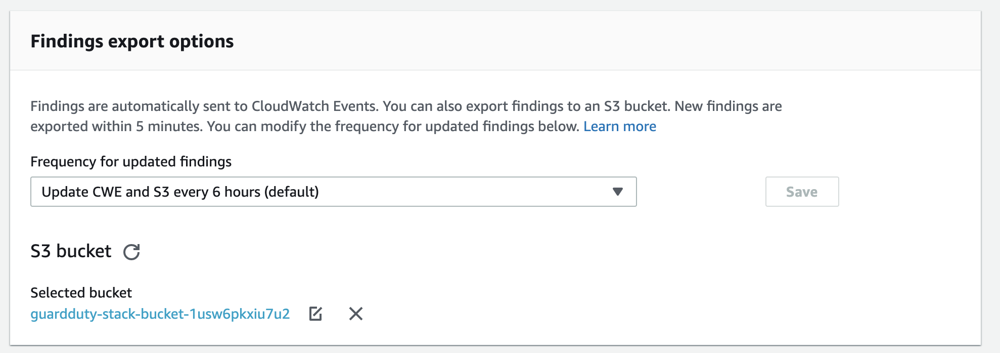

## AWS Guardduty - Cloudformation template with inline Lambda

#### Description:  

For AWS Guardduty there's no Cloudformation resource to create & publish its findings to a destination, but this template with inline lambda solves that problem.

 The cloudformation template configures most of the necessary components using native cloudformation resources, such as, kms key & alias, s3 bucket & its policies, necessary iam role & policy, including creation of guardduty detector.

The inline lambda takes arn & logical Ids of dependant resources as an environment var and configures s3 bucket as a publishing destination to export its findings

